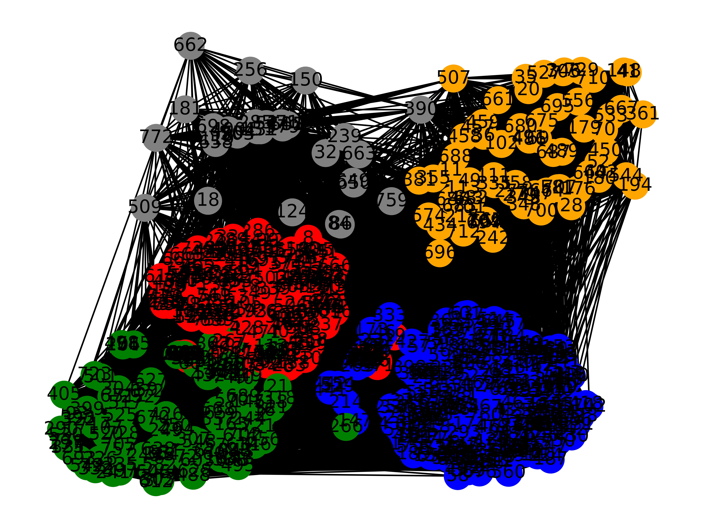

# Tweet Analysis

Work in process. For a master lecture project at University of Fribourg, Switzerland.

## Introduction
This project aims to analyze a collection of tweets stored in a CSV file. The goal is to extract relevant information, filter out irrelevant tweets, and create a graph representation based on the similarities between tweets.

## Experiments
Unit experiments are available in the experiments folder. Learn more about these scripts by reading the README.md file in the experiments folder.

## Contributors
- Anu and JM

## Sample Output
